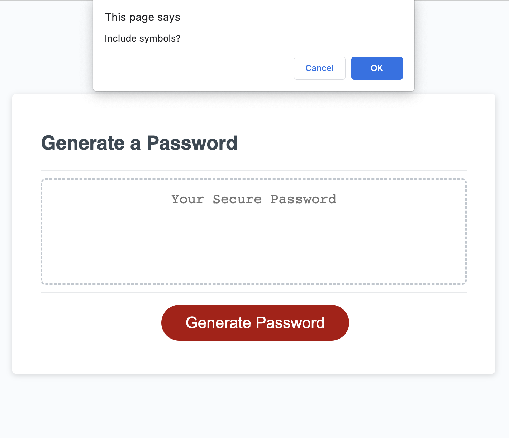
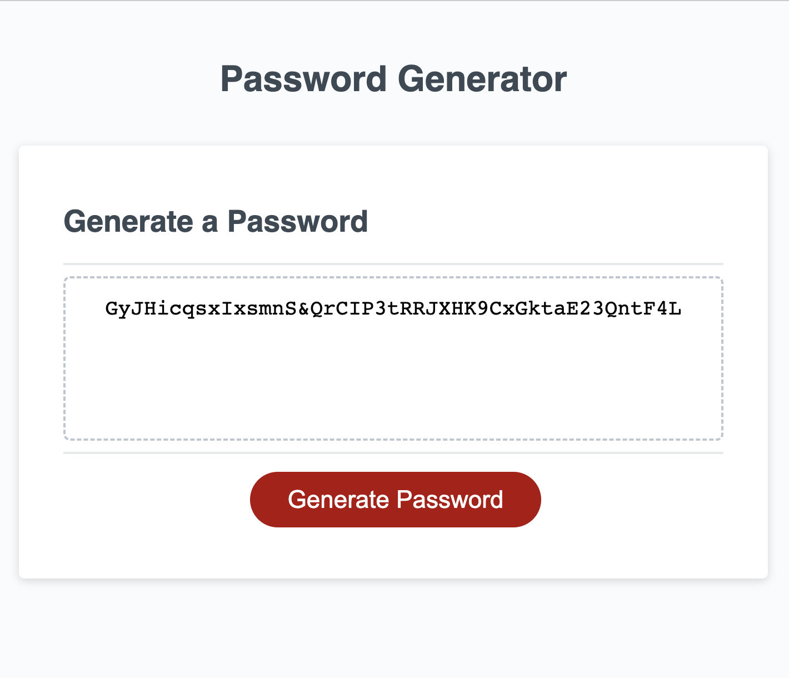

# Random Password Generator
Module 03 Homework for Univ of Oregon coding bootcamp; creating a random password generator. 

 ## Description
 This webpage is designed to help the user generate a password based on certain criteria. The user can pick specification like uppercase, lowercase, symbols, or numbers for entry and length as long as the length is between 8 and 128 characters. These events and the result will be triggered based on the click function of the generate button. 

## Usage
This code can be edited with different string variables to be used in the random password generator and different parameters can be set for length. 

 ## Installation
 This code can be downloaded via Zip files and imported to an IDE. 

 ## Screenshots of Deployed Application
 This is an image of the window prompts for password criteria:
 
 This is an image of the random password printed on the HTML file.
 
  

 ## Link for Deployment
 https://mereljac.github.io/password-generator/

## Notes
This code was refactored as an assignment and originally belongs to the University of Oregon and sourced from GitHub.com/coding-boot-camp/friendly-parakeet.